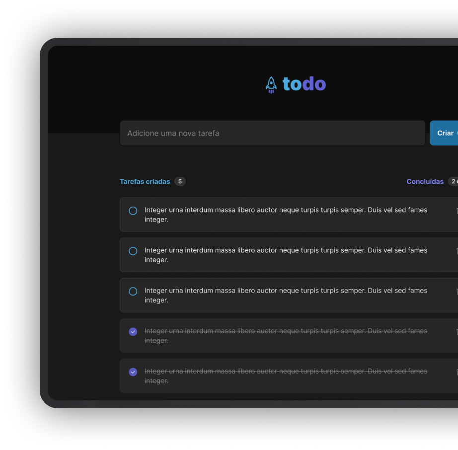

# Todo App

## Description
<h1 align="center">
    <a href="https://pt-br.reactjs.org/">🔗 React</a>
</h1>

🚀 Project made based on the proposed challenge of the React.js fundamentals module from Rocketseat's Ignite track.

<h1 align="center">
  
</h1>

### 🛠 Technologies

The following tools were used to build the project:

- [React](https://react.dev/)
- [Date-fns](https://date-fns.org/)
- [Phosphor-react](https://phosphoricons.com/)
- [Eslint](https://eslint.org/)
- [TypeScript](https://www.typescriptlang.org/)

<h4>Link para o todo-app</h4>
<a href="https://todotnb.netlify.app">Todo-app</a>
